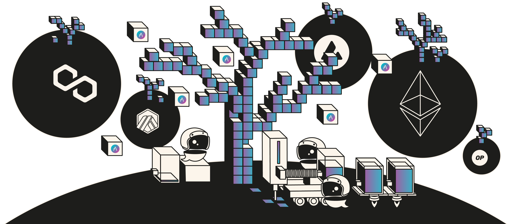

# Aave V3.2 Origin



Aave v3.2 complete codebase, Foundry-based.

[](https://aave-dao.github.io/aave-v3-origin)
<br>

## Dependencies

- Foundry, [how-to install](https://book.getfoundry.sh/getting-started/installation) (we recommend also update to the last version with `foundryup`)
- Lcov
  - Optional, only needed for coverage testing
  - For Ubuntu, you can install via `apt install lcov`
  - For Mac, you can install via `brew install lcov`

<br>

## Setup

```sh
cp .env.example .env

forge install

# required for tests & linting
npm install
```

<br>

## Tests

- To run the full test suite: `make test`
- To re-generate the coverage report: `make coverage`

<br>

## Documentation

- [Aave v3 technical Paper](./docs/Aave_V3_Technical_Paper.pdf)
- [v3 to v3.0.2 production upgrade](https://github.com/bgd-labs/proposal-3.0.2-upgrade/blob/main/README.md)
- [Aave v3.1 features](./docs/Aave-v3.1-features.md)
- [Aave v3.2 features](./docs/3.2/Aave-v3.2-features.md)
- [v3.1 to v3.2.0 production upgrade](https://github.com/bgd-labs/protocol-3.2.0-upgrade/blob/main/README.md)
- [Set Ltv to 0 on Freeze Feature State diagram](./docs/freeze-ltv0-states.png)

<br>

## Security

Aave v3.1 is an upgraded version of Aave v3, more precisely on top of the initial Aave v3 release and a follow-up 3.0.2 later update.

The following are the security procedures historically applied to Aave v3.X versions.

<br>

**-> Aave v3**

- [ABDK](./audits/27-01-2022_ABDK_AaveV3.pdf)
- [OpenZeppelin](./audits/01-11-2021_OpenZeppelin_AaveV3.pdf)
- [Trail of Bits](./audits/07-01-2022_TrailOfBits_AaveV3.pdf)
- [Peckshield](./audits/14-01-2022_PeckShield_AaveV3.pdf)
- [SigmaPrime](./audits/27-01-2022_SigmaPrime_AaveV3.pdf)
- [Certora](./certora/Aave_V3_Formal_Verification_Report_Jan2022.pdf)

<br>

**-> Aave v3.0.1 - December 2022**

- [PeckShield](./audits/09-12-2022_PeckShield_AaveV3-0-1.pdf)
- [SigmaPrime](./audits/23-12-2022_SigmaPrime_AaveV3-0-1.pdf)

<br>

**-> Aave v3.0.2 - April 2023**

- [SigmaPrime](./audits/19-04-2023_SigmaPrime_AaveV3-0-2.pdf)
- [Certora](./audits/03-2023_2023_Certora_AaveV3-0-2.pdf)

<br>

**-> Aave v3.1 - April 2024**

- [Certora](./audits/30-04-2024_Certora_AaveV3.1.pdf)
- [MixBytes](./audits/02-05-2024_MixBytes_AaveV3.1.pdf)
- An internal review by [SterMi](https://twitter.com/stermi) on the virtual accounting feature was conducted on an initial phase of the codebase.
- [Cantina competition report](./audits/02-06-2024-Cantina-contest-AaveV3.1.pdf)
- Additionally, Certora properties have been improved over time since the Aave v3 release. More details [HERE](./certora/basic/README.md).

<br>

**-> Aave v3.2 - September 2024**

#### Stable Rate and Liquid eModes

- [Certora](./audits/2024-09-10_Certora_Aave-v3.2_Stable_Rate_Removal.pdf)
- [Enigma Dark](./audits/2024-09-30_Enigma_Aave-v3.2.pdf)

#### Liquid eModes

- [Certora](./audits/2024-09-19_Certora_Aave-v3.2_Liquid_eModes.pdf)
- [Oxorio](./audits/2024-09-12_Oxorio_Aav3-v3.2.pdf)
- [Pashov](./audits/2024-09-15_Pashov_Aave-v3.2.pdf)

<br>

**-> Aave v3.3 - January 2025**

#### Deficit tracking & Liquidation optimizations

- [Certora](./audits/2024-11-07_Certora_Aave-v3.3.0.pdf)
- [StErMi](./audits/2024-10-22_StErMi_Aave-v3.3.pdf)
- [Oxorio](./audits/2025-01-29_Oxorio_Aave-v3.3.0.pdf)
- [Sherlock](./audits/2025-01-22_Sherlock_Aave-v3.3.0.pdf)

In addition, Enigma Dark has adapted the Foundry-based fuzzing [invariant suite](./tests/invariants) to the Aave v3.3 codebase.

<br>

### Bug bounty

This repository will be subjected to [this bug bounty](https://immunefi.com/bounty/aave/) once the Aave Governance upgrades the smart contracts in the applicable production instances.

<br>

## License

Copyright © 2024, Aave DAO, represented by its governance smart contracts.

The [BUSL1.1](./LICENSE) license of this repository allows for any usage of the software, if respecting the Additional Use Grant limitations, forbidding any use case damaging anyhow the Aave DAO's interests.
Interfaces and other components required for integrations are explicitly MIT licensed.
