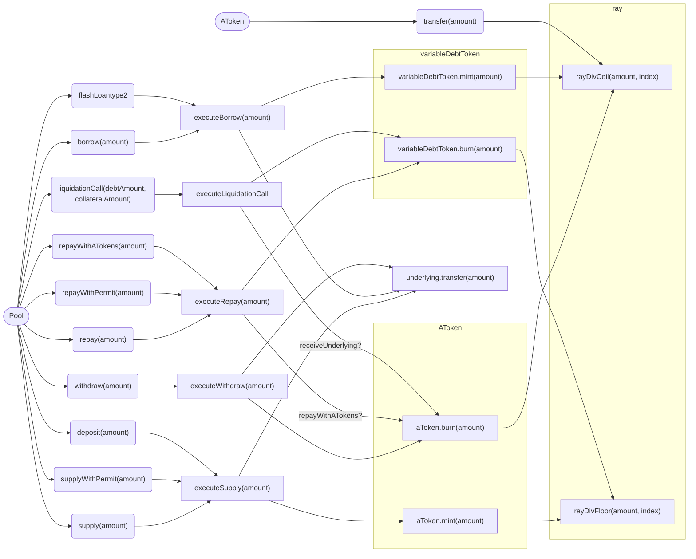

# Aave v3.5 features properties

Formal properties in natural language of the 3.5 features.

## Properties

### 1. Rounding

In the following properties `shares` refers to the `scaled balance`, while `assets` refers to the underlying.

- when supplying `x` assets, the protocol should mint an equivalent of aToken shares, so that `shares = floor(x / index)`
- when withdrawing `x` assets, the protocol should burn an equivalent of aToken shares, so that `shares = ceil(x / index)`
- when evaluating the aToken balance of a user, the balance should be calculated as `balance = floor(shares * index)`
- when borrowing `x` assets, the protocol should mint an equivalent of vToken shares, so that `shares = ceil(x / index)`
- when repaying `x` assets, the protocol should burn an equivalent of vToken shares, so that `shares = floor(x / index)`
- when evaluating the vToken balance of a user, the balance should be calculated as `balance = ceil(shares * index)`
- when calculating the `liquidationProtocolFeeAmount` and the fee distributed to the treasury, the received shares should be rounded up
- the flashLoanPremium is always rounded up, meaning that even when flashing just 1 wei of an asset, you will pay 1 wei of fee (where in previous versions of the protocol, the fee would be rounded to zero)
- when calculating the value of a user's collateral (aTokens) in the base currency, the result of `(balanceInAssetUnits * assetPrice) / assetUnit` is rounded down. (this was already the case in previous versions of the protocol for `GenericLogic._getUserBalanceInBaseCurrency`)
- when calculating the totalSupply of the aToken, `totalScaledSupply * index` is rounded down.
- when calculating the value of a user's total debt (vTokens) in the base currency, the result of `(debtInAssetUnits * assetPrice) / assetUnit` is rounded up.
- when calculating the totalSupply of the vToken, `totalScaledSupply * index` is rounded up.

