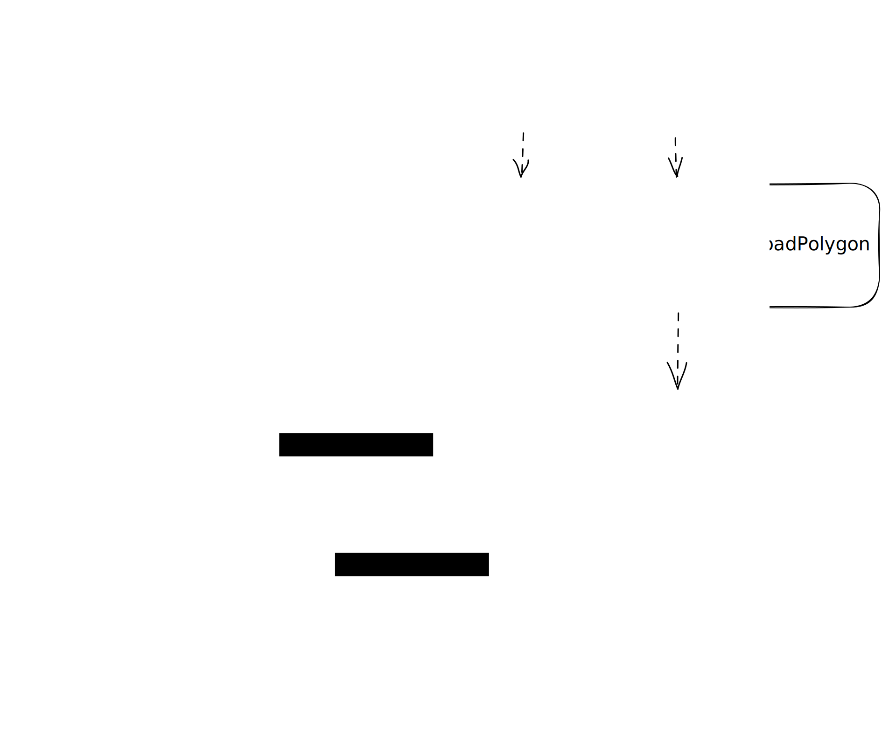

## Aave v3 config engine

## What is the AaveV3ConfigEngine?

The `AaveV3ConfigEngine` is a helper smart contract to abstract good practices when doing "admin" interactions with the Aave v3 protocol, but built on top, without touching the core contracts.

At the same time, it defines a new interface oriented to simplify developer experience when coding proposal payloads: the `AaveV3ConfigEngine` is built from our experience supervising governance payloads review, for actions like full cycle of listing assets, modify caps (supply/borrow), changing collateral or borrow related parameters and changing the price feeds of assets.

_Note: In an effort for unification and streamlining deployment procedures, the config engine has been migrated from the [aave-helpers](https://github.com/bgd-labs/aave-helpers) repository to this location._

## How to use the engine?

The engine is not designed to be used directly when writing a payload, but through abstract contracts that we will call `Base Aave v3 Payloads`.

This [aave-helpers](https://github.com/bgd-labs/aave-helpers) repository contains `Base Aave v3 Payloads` for all the Aave v3 instances, under the hood powered by this config engine and aave-address-book, and abstracting all the complexity: ordering of execution of actions, extra validations, deciding when to keep a current configured parameter and how to get it, etc.

As base for any payload, you only need to inherit from the corresponding (per pool) `Base Aave v3 Payload`, for example inheriting from `AaveV3PayloadEthereum` in the case of Ethereum, `AaveV3PayloadAvalanche` in the case of Avalanche, and so on.

If you want just to do one or multiple listings, you only need to define the listing within a `newListings()` function, and the base payload will take care of executing it correctly for you.

Do you want instead to update supply/borrow caps? Same approach as with the listings, you only need to define the update of caps within a `capsUpdates()` function, and the base payload will take care of the rest.

Do you want to update the price-feed of an asset? You only need to define the update of price feed within a `priceFeedsUpdates()` function, and the base payload will take care of the rest.

Change collateral-related parameters? Same approach as previous, you only need to define the update within a `collateralsUpdates()` function, and the base payload will take care of the rest.

Change Borrow-related parameters? Same as previous, just define the update within a `borrowsUpdates()` function, and the base payload will take care of the rest.

Change eMode category configuration? Same as previous, just define the update within a `eModeCategoriesUpdates()` function, and the base payload will take care of the rest.

Change eMode category of a particular asset? Same as previous, just define the update within a `assetsEModeUpdates()` function, and the base payload will take care of the rest.

Create a new eMode category? Same as previous, just define the update within a `eModeCategoryCreations()` function, and the base payload will take care of the rest.

### Internal aspects to consider

- Frequently, at the same time that you want to do an update of parameters or listing, you also want to do something extra before or after.
  The `Base Aave v3 Payload` defines `_preExecute()` and `_postExecute()` hook functions, that you can redefine on your payload and will the execute before and after all configs changes/listings you define.

- The payload also allow you to group changes of parameters and listings, just by defining at the same time the aforementioned `newListings()`, `capsUpdate()` and/or `collateralsUpdates()` and so on. For reference, the execution ordering is the following:
  1. `_preExecute()`
  2. `newListings()`
  3. `newListingsCustom()`
  4. `eModeCategoriesUpdates()`
  5. `assetsEModeUpdates()`
  6. `eModeCategoryCreations()`
  7. `borrowsUpdates()`
  8. `collateralsUpdates()`
  9. `rateStrategiesUpdates()`
  10. `priceFeedsUpdates()`
  11. `capsUpdates()`
  12. `_postExecute()`

## Links to examples

- [Simple mock listing on Aave v3](../../../../tests/periphery/v3-config-engine/mocks/AaveV3MockListing.sol)
- [Simple custom mock listing on Aave V3 with custom token impl](../../../../tests/periphery/v3-config-engine/mocks/AaveV3MockListingCustom.sol)
- [Mock e-mode category update on Aave V3](../../../../tests/periphery/v3-config-engine/mocks/AaveV3MockEModeCategoryUpdate.sol)
- [Mock e-mode asset update on Aave V3](../../../../tests/periphery/v3-config-engine/mocks/AaveV3MockAssetEModeUpdate.sol)
- [Mock caps updates (only supply, keeping current borrow cap) on Aave v3](../../../../tests/periphery/v3-config-engine/mocks/AaveV3MockCapUpdate.sol)
- [Mock collateral updates (changing some, keeping current values on others), on Aave v3](../../../../tests/periphery/v3-config-engine/mocks/AaveV3MockCollateralUpdate.sol)
- [Mock borrow updates (changing some, keeping current values on others), on Aave v3](../../../../tests/periphery/v3-config-engine/mocks/AaveV3MockBorrowUpdate.sol)
- [Mock rates updates (changing some, keeping current values on others), on Aave v3](../../../../tests/periphery/v3-config-engine/mocks/AaveV3MockRatesUpdate.sol)
- [Mock price feed updates on Aave v3](../../../../tests/periphery/v3-config-engine/mocks/AaveV3MockPriceFeedUpdate.sol)
