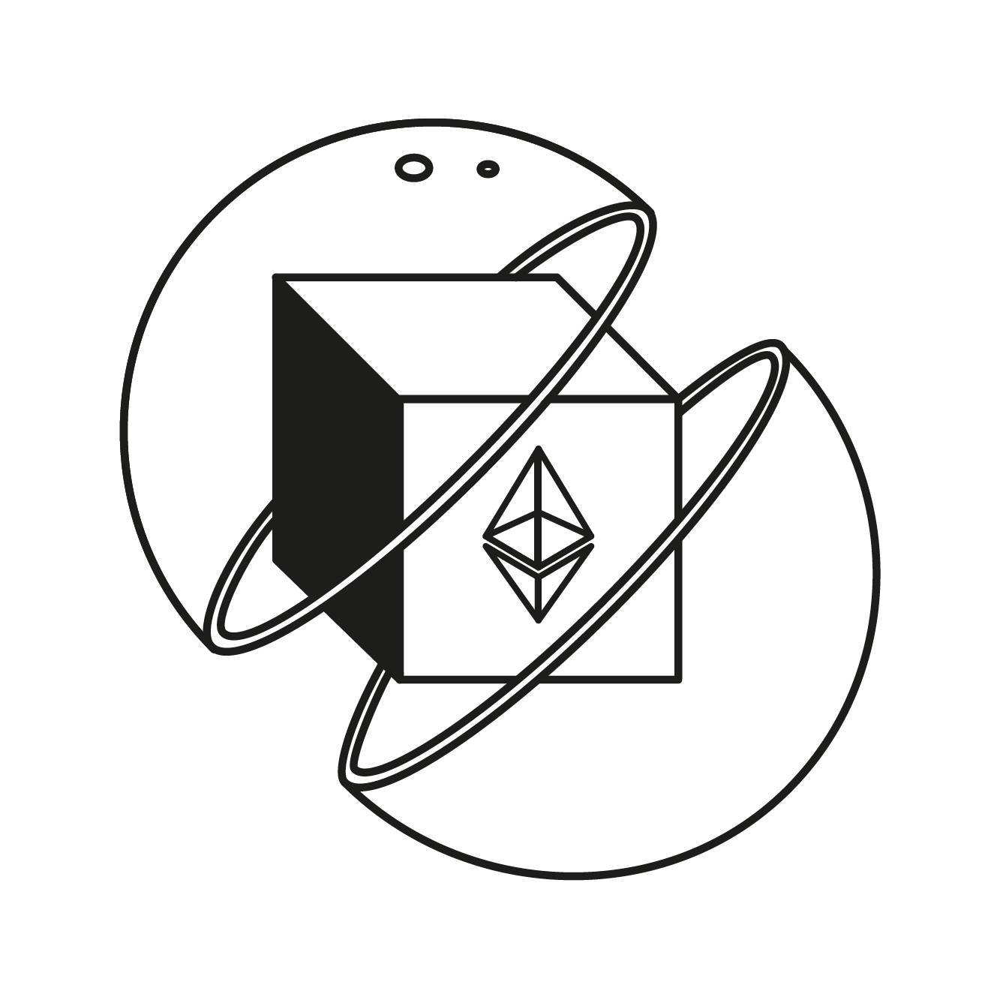

# stataToken - Static aToken vault/wrapper

<p align="center">

</p>

## About

The static-a-token contains an [EIP-4626](https://eips.ethereum.org/EIPS/eip-4626) generic token vault/wrapper for all Aave v3 pools.

## Features

- **Full [EIP-4626](https://eips.ethereum.org/EIPS/eip-4626) compatibility.**
- **Accounting for any potential liquidity mining rewards.** Let’s say some team of the Aave ecosystem (or the Aave community itself) decides to incentivize deposits of USDC on Aave v3 Ethereum. By holding `stataUSDC`, the user will still be eligible for those incentives.
  It is important to highlight that while currently the wrapper supports infinite reward tokens by design (e.g. AAVE incentivizing stETH & Lido incentivizing stETH as well), each reward needs to be permissionlessly registered which bears some [⁽¹⁾](#limitations).
- **Meta-transactions support.** To enable interfaces to offer gas-less transactions to deposit/withdraw on the wrapper/Aave protocol (also supported on Aave v3). Including permit() for transfers of the `stataAToken` itself.
- **Upgradable by the Aave governance.** Similar to other contracts of the Aave ecosystem, the Level 1 executor (short executor) will be able to add new features to the deployed instances of the `stataTokens`.
- **Powered by a stataToken Factory.** Whenever a token will be listed on Aave v3, anybody will be able to call the stataToken Factory to deploy an instance for the new asset, permissionless, but still assuring the code used and permissions are properly configured without any extra headache.

See [IStaticATokenLM.sol](./interfaces/IStaticATokenLM.sol) for detailed method documentation.

## Deployed Addresses

The staticATokenFactory is deployed for all major Aave v3 pools.
An up to date address can be fetched from the respective [address-book pool library](https://github.com/bgd-labs/aave-address-book/blob/main/src/AaveV3Ethereum.sol).

## Limitations

The `stataToken` is not natively integrated into the aave protocol and therefore cannot hook into the emissionManager.
This means a `reward` added **after** `statToken` creation needs to be registered manually on the token via the permissionless `refreshRewardTokens()` method.
As this process is not currently automated users might be missing out on rewards until the method is called.

## Security procedures

For this project, the security procedures applied/being finished are:

- The test suite of the codebase itself.
- Certora audit/property checking for all the dynamics of the `stataToken`, including respecting all the specs of [EIP-4626](https://eips.ethereum.org/EIPS/eip-4626).

## Upgrade Notes Umbrella

- Interface inheritance has been changed so that `IStaticATokenLM` implements `IERC4626`, making it easier for integrators to work with the interface.
- The static A tokens are given a `rescuable`, which can be used by the ACL admin to rescue tokens locked to the contract.
- Permit params have been excluded from the METADEPOSIT_TYPEHASH as they are not necessary. Even if someone were to frontrun the permit via mempool observation the permit is wrapped in a `try..catch` to prevent griefing attacks.
- The static a token not implements pausability, which allows the ACL admin to pause all transfers.

The storage layout diff was generated via:
```
git checkout main
forge inspect src/periphery/contracts/static-a-token/StaticATokenLM.sol:StaticATokenLM storage-layout --pretty > reports/StaticATokenStorageBefore.md
git checkout project-a
forge inspect src/periphery/contracts/static-a-token/StaticATokenLM.sol:StaticATokenLM storage-layout --pretty > reports/StaticATokenStorageAfter.md
make git-diff before=reports/StaticATokenStorageBefore.md after=reports/StaticATokenStorageAfter.md out=StaticATokenStorageDiff
```
