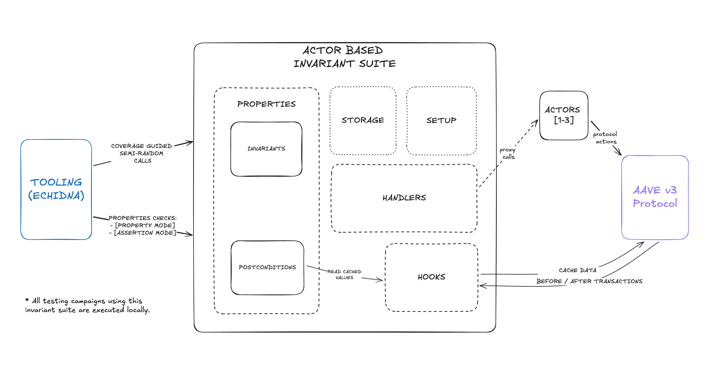

# Actor Based Invariant Testing Suite

 

 

The Actor Based Invariant Testing Suite is a framework for performing comprehensive invariant testing of the Aave v3 protocol. Using an actor-based model, it simulates realistic scenarios with various entities interacting with the system, ensuring that protocol invariants and postconditions hold under an extensive range of conditions.

The suite is designed to support multi-actor tooling, randomizing actions, parameters, actor roles, and asset selection to explore edge cases and ensure the robustness of a protocol.

# Specifications

Extensive documentation regarding the architecture and design of the suite can be found [HERE](./docs/overview.md).

Further documentation outlining the properties of the system (both invariants and postconditions) can be found [HERE](./specs/).

Hands-on internal documentation for developers & researchers on how to use and build on top of the suite can be found [HERE](./docs/internal-docs.md).

# Tooling

The suite has been developed and tested using the following tools:

- [Echidna](https://github.com/crytic/echidna): A battle tested property-based testing tool for Ethereum smart contracts.
- [Foundry](https://book.getfoundry.sh/forge/): Foundry is a fast, modular, and developer-friendly toolchain for testing, deploying, and interacting with Ethereum smart contracts.

# How to run the suite?

Instructions for setting up the project and running the testing suite with echidna are available [HERE](./docs/overview.md#running-the-suite).

 

**Development & Attribution**
This suite was developed by Enigma Dark after being engaged by BGD Labs to provide security services for the Aave v3 protocol, ensuring that best practices in security and testing are satisfied.
