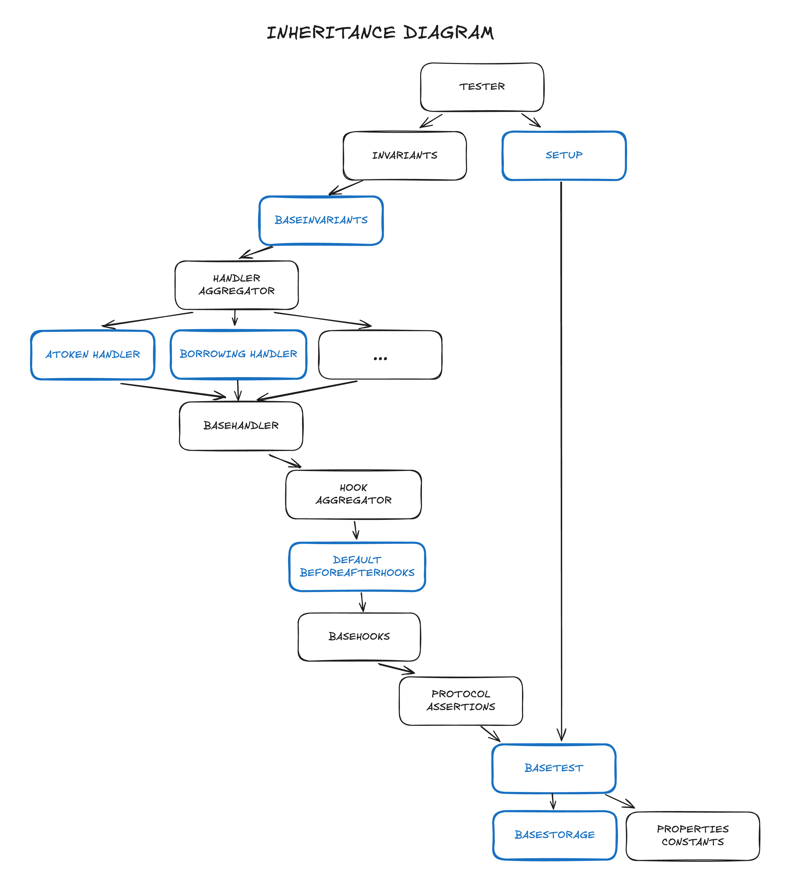

This document aims to present a high-level view of the architecture of the Actor-Based Invariant Testing Suite developed for the Aave v3 protocol.

# System overview

<br />

<br />

The Invariant Testing Suite serves as middleware between the tooling and the Protocol. The system’s setup can be split into the following components:

- **Tooling**: Tool or set of tools used to test the system, targeting the suite middleware in order to conduct fuzzing campaigns and check properties. In this case, the tooling used is Echidna, a property-based testing tool for Ethereum smart contracts.
- **Test Suite**: Middleware that connects the tooling with the protocol, which orchestrates all interactions with it, including the actors, handlers, and properties. It is responsible for setting up the environment, running the tests, and reporting the results.
- **Local Protocol Deployment**: Local testing deployment of the protocol, whose setup is primarily based on the existing deployment scripts of Aave v3. The Test Suite contracts are designed to setup and interact with this deployment of the protocol.

## Inheritance Hierarchy

The Test Suite centers around the main `Tester` contract, which inherits from several other contracts, each designated with a specific function within the system. The inheritance hierarchy appears as follows:
<br /><br />


<br />

This illustrates the inheritance graph for the suite.

# Test Suite Architecture

The Test Suite follows a modular architecture designed to address the different types of properties and upgrade needs for deployed protocols like Aave. It is designed to be flexible and easy to integrate with new features, allowing for the reuse of existing components and the addition of new ones. The Test Suite is composed of the following components:

- **Base**: Base contracts of the Test Suite, which include the Storage contract, the Setup contract, and a few more. The Storage contract is responsible for storing protocol deployment addresses and extra variables, while the Setup contract is responsible for setting up the environment for the tests.
- **Actors**: Actors of the Test Suite, which represent the different entities interacting with the protocol. Each actor is a proxy-like contract that forwards specific actions from the handlers to the protocol.
- **Handlers**: Contracts that contain external-facing functions for tooling to execute user actions via actors. They are designed to be modular and extensible, allowing for the addition of new functions and features (eg. liquid eModes).
- **Hooks**: Responsible for caching protocol and user values before and after calls, as well as executing global postconditions. They are designed to be modular and extensible, allowing for the incorporation of additional postconditions and value caching as needed.
- **Properties**: Contracts that define the specifications and implement the required checks to ensure properties hold in the system.

## Base

The base contracts of the Test Suite are responsible for setting up the environment for the tests, storing the protocol deployment addresses and extra variables and helper functions for handlers and hooks.

It is composed by the following smart contracts:

- **BaseHandler**: Base contract that contains helper functions for the handlers such as random selectors for assets, Atokens, DebtTokens, eMode categories and priceAggregators. It is inherited by all handler contracts.

- **BaseHooks**: Base contract where common logic for the hooks is implemented. In the case of this suite, no helper functions are implemented in this contract it is just used to agregate parent contracts: ProtocolAssertions and SpecAggregator.

- **BaseStorage**: Storage contract that stores protocol deployment addresses and extra variables. This contract is the root of the inheritance chain, serving as the main parent contract.

- **BaseTest**: Test temmplate contract that contains general protocol helper functions and the `setup` actor selector modifier implementation. It is inherited by all test contracts.

- **ProtocolAssertions**: Helper contract for protocol specific assertions which are reused along the codebase.

## Actors

Actors are smart contract entities that interact with the protocol as showcased in the diagram. These contracts act as a proxy between the handlers and the protocol, forwarding actions to the protocols acting as the "real" users. The tooling for this suite is configured to randomly use three callers `USER1`, `USER2` and `USER3` to interact with the handlers. The `setup` modifier in the `BaseTest` contract is used on every user handler to select the actor to be used in the proxied call to the protocol based on the caller of the handler function.

Example: `setup` Modifier in Action

```solidity
function repayWithATokens(uint256 amount, uint8 i) external setup {
  /// setup modifier selects the actor to be used in the proxied call
  /// based on the caller of this handler function

  bool success; /// success flag and returnData for the proxied call are declared at the beginning of the function
  bytes memory returnData;

  ...

  address target = address(pool);

  _before();

  /// actor.proxy is used to call the protocol, targetting the protocol with the required calldata
  (success, returnData) = actor.proxy(
    target,
    abi.encodeWithSelector(
      IPool.repayWithATokens.selector,
      asset,
      amount,
      DataTypes.InterestRateMode.VARIABLE
    )
  );

  if (success) { /// success flag is checked to ensure the call was successful in order to make further checks
    _after();
    ...
  }
}
```

The Actor contract is located under `utils/`.

## Handlers

The Handlers contain the main functions exposed to the tooling, allowing it to execute actions through actors. They have been divided in three different categories: `user`, `permissioned` and `simulators`. Each of them implementing different actions and functionalities of the protocol, from user actions to price movement simmulators.

- **User**: Handlers that contain functions to execute user actions in the protocol. These actions are executed by the actors and are used to test the protocol's behavior under different scenarios. All the exposed user functions on these handler category use the `setup` mmodifier showed above. Includes `ATokenHandler`, `LendingHandler`, `LiquidationHandler`, `PoolHandler`, `BorrowingHandler` and `VariableDebtTokenHandler`.

- **Permissioned**: Handlers that contain functions to execute permissioned actions in the protocol. These actions are executed by the Tester contract itself (set as the protocol permmissioned role for efficiency purposes). Includes `PoolPermissionedHandler`.

- **Simulators**: Handlers that contain functions which simulate real world external changes like donation attacks, asset price movements or flashloans. Includes `DonationAttackHandler`, `FlashLoanHandler` and `PriceAggregatorHandler`.

## Hooks

Hooks handle caching of protocol and user values and enforce postconditions across the suite. They allow for modular expansion to add new postconditions, or additional value caching as needed.

- `DefaultBeforeAfterHooks`: Abstract contract that contains the `DefaultVars` struct and custom setter functions, which is essential for caching protocol and user values before and after function calls. It also implements the global postconditions (GPOST) to be invoked in the `HookAggregator::_checkPostConditions` function.
- `HookAggregator`: This contract aggregates various hooks (only the default one in this case) and invokes the `_checkPostConditions` function to execute the global postconditions.

Values are cached before and after nearly every handler call using `_after` and `_before` functions. The `DefaultVars` struct contains the following fields:

```solidity
    // Pool
    uint256[] reseveNormalizedIncome;
    uint256[] reserveNormalizedVariableDebt;
    uint256[] virtualUnderlyingBalance;
    // Reserve
    uint256 totalSupply;
    uint256 scaledTotalSupply;
    uint256 totalBorrow;
    uint256 supplyCap;
    uint256 borrowCap;
    uint256 accruedToTreasury;
    // Health
    bool isHealthy;
    // User account data
    uint256 totalCollateralBase;
    uint256 totalDebtBase;
    uint256 currentLiquidationThreshold;
    uint256 ltv;
    uint256 healthFactor;
```

Example: `_checkPostConditions` function, called at the end of the `_after` hook

```solidity
function _after() internal {
  _defaultHooksAfter();

  // POST-CONDITIONS
  _checkPostConditions();

  // RESET
  _resetTargetAsset();
}

/// @notice Postconditions for the handlers
function _checkPostConditions() internal {
  // Implement post conditions here

  // BASE
  assert_BASE_GPOST_A();
  assert_BASE_GPOST_BCD();

  // LENDING
  assert_LENDING_GPOST_C();

  // BORROWING
  assert_BORROWING_GPOST_H();

  // LIQUIDATION
  assert_LIQUIDATION_GPOST_B();
}
```

## Properties

Inside this testing suite, properties are the most important component, everything else works as scaffolding, helpers and setup scripts to ensure the tooling is able to reach the most amount of edge cases possible. The properties are the actual checks that are being run, they are the ones that ensure the protocol is behaving as expected. The properties are divided in two categories: invariants and postconditions.

- **Invariants**: Properties that should always hold true in the system. The tooling executes them in between every transaction to ensure the system is not in an invalid state. They are implemented in the `BaseInvariants` contract following the specs at `InvariantsSpec`.

- **Postconditions**: Properties that should hold true after a specific action is executed. There are two types of postconditions: global postconditions (GPOST) and handler specific postconditions (HSPOST).
  - **GPOST**: Postconditions that are executed after every handler call. They are implemented in the `HookAggregator` contract.
  - **HSPOST**: Postconditions that are executed after specific handler calls, very similar to unit test assertions. They are usually implemented in the success block at the end of a handler function.
